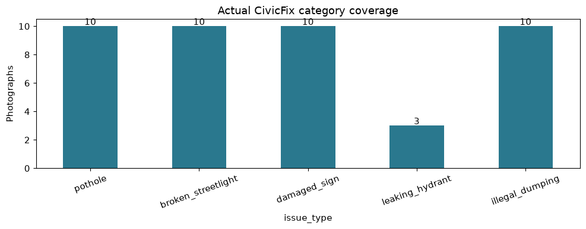
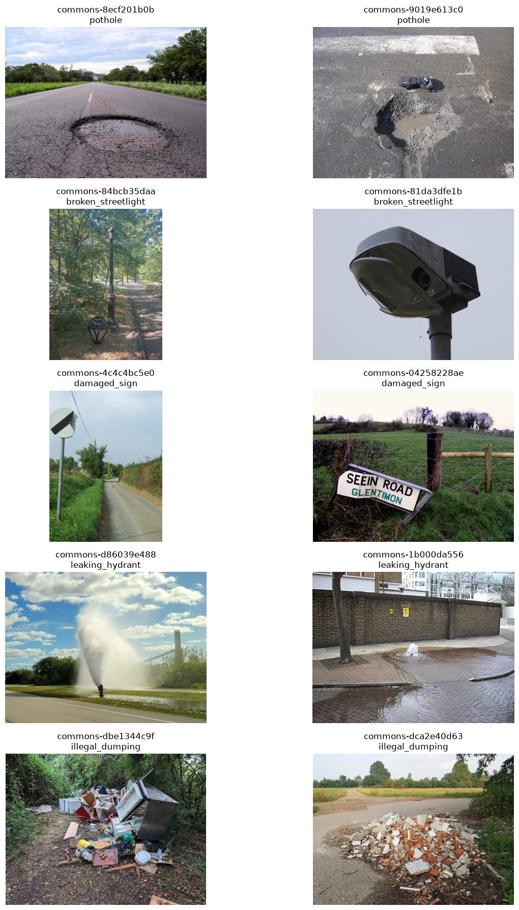

# Saved notebook output preview

These images and figures are extracted from the actual saved, clean-clone **github** run of [playground.ipynb](../playground.ipynb). This Markdown view is a fallback because the GitHub notebook viewer returned “Unable to render code block” during browser inspection. The notebook itself has validated JSON, saved outputs and zero cell errors.

Dataset: **CivicFix Commons Curated Collection v1**. 43 photographs, 13,020,816 image bytes (12.418 MiB), 21 manifest fields. Pinned dataset commit: `8394bf6d0d84c9dbf33e69258f0cd15ee4795ca4`.

| Category | Images |
|---|---:|
| `pothole` | 10 |
| `broken_streetlight` | 10 |
| `damaged_sign` | 10 |
| `leaking_hydrant` | 3 |
| `illegal_dumping` | 10 |

## Real examples

Grid components retain their individual image licenses. These are resized JPEG preview derivatives of the stored JPEG derivatives; individual attribution and transformation notices are also in [DATA_SOURCES](DATA_SOURCES.md).

| Image ID | Author | License | Original source |
|---|---|---|---|
| `commons-8ecf201b0b` | Uncl3dad | [Public domain](https://commons.wikimedia.org/w/index.php?oldid=1211866573) | [Original file](https://commons.wikimedia.org/wiki/File:Pothole_Big.jpg) |
| `commons-9019e613c0` | Miguel Tremblay | [Public domain](https://commons.wikimedia.org/w/index.php?oldid=1205771119) | [Original file](https://commons.wikimedia.org/wiki/File:Pothole_in_Villeray,_Montr%C3%A9al.jpg) |
| `commons-84bcb35daa` | Jay Dobkin | [CC BY-SA 4.0](https://creativecommons.org/licenses/by-sa/4.0) | [Original file](https://commons.wikimedia.org/wiki/File:Decapitated_lamppost_in_Central_Park_01.jpg) |
| `commons-81da3dfe1b` | ŠJů | [CC BY 4.0](https://creativecommons.org/licenses/by/4.0) | [Original file](https://commons.wikimedia.org/wiki/File:Chalupkova,_rozbit%C3%A1_lampa_425096.jpg) |
| `commons-4c4c4bc5e0` | Keith Evans | [CC BY-SA 2.0](https://creativecommons.org/licenses/by-sa/2.0) | [Original file](https://commons.wikimedia.org/wiki/File:Broken_road_sign_-_geograph.org.uk_-_975071.jpg) |
| `commons-04258228ae` | Kenneth  Allen | [CC BY-SA 2.0](https://creativecommons.org/licenses/by-sa/2.0) | [Original file](https://commons.wikimedia.org/wiki/File:Damaged_road_sign_along_Seein_Road_-_geograph.org.uk_-_4325202.jpg) |
| `commons-d86039e488` | Kiran891 | [CC BY-SA 4.0](https://creativecommons.org/licenses/by-sa/4.0) | [Original file](https://commons.wikimedia.org/wiki/File:Broken_fire_hydrant_leak_high-pressure_water_spout_(2023,_Vero_Beach,_Florida)_01.jpg) |
| `commons-1b000da556` | PAUL FARMER | [CC BY-SA 2.0](https://creativecommons.org/licenses/by-sa/2.0) | [Original file](https://commons.wikimedia.org/wiki/File:Leaking_Fire_Hydrant_-_geograph.org.uk_-_1219371.jpg) |
| `commons-dbe1344c9f` | The wub | [CC BY-SA 4.0](https://creativecommons.org/licenses/by-sa/4.0) | [Original file](https://commons.wikimedia.org/wiki/File:Fly_tipping_near_High_Beech,_Essex.jpg) |
| `commons-dca2e40d63` | Mænsard vokser | [CC BY-SA 4.0](https://creativecommons.org/licenses/by-sa/4.0) | [Original file](https://commons.wikimedia.org/wiki/File:Fly-tipping_construction_waste_in_Parco_Alto_Milanese_-_Busto_Arsizio,_Lombardy,_Italy.jpg) |

## Measured checks and limits

All 43 images decoded and matched their stored SHA-256. Missing required values, duplicate IDs/paths, unsupported labels, missing files, hash mismatches, byte duplicates, conflicting hash labels, EXIF and GPS fields were all zero. Three near-duplicate screening pairs were visually compared and found to show different scenes.

Hydrant coverage remains limited; two examples rely on source captions without a visible hydrant body. Nighttime, weather and Gainesville coverage remain missing or weak. Agent labels are not independent human validation, and no model accuracy was measured. See [DATA_QUALITY](DATA_QUALITY.md) and [SUBMISSION](SUBMISSION.md).
